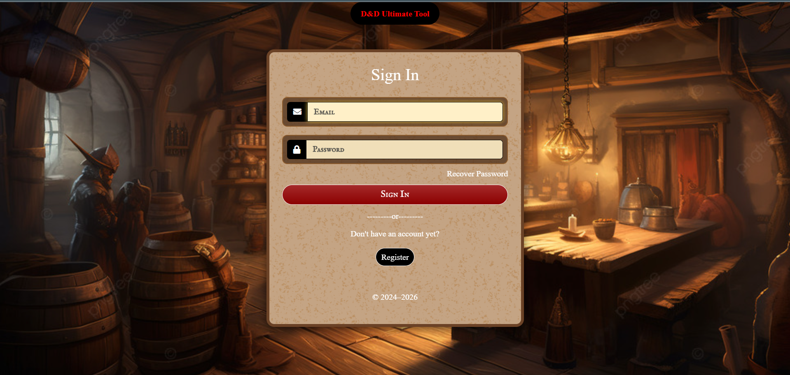

 
 
 

🎲 D&D Ultimate Tool
==========================
(Egy webes alkalmazás, amely segít a **Dungeons & Dragons** játékosoknak és mesélőknek a kampánykezelésben.  
A projekt **React** frontendet és **ASP.NET** backendet használ, az adatok tárolására pedig **MySQL** adatbázist.

## 📖 Tartalomjegyzék
* [Projekt információk](#projekt-információk)
  * [Cél](#cél)
  * [Célközönség](#célközönség)
* [Funkciók](#-funkciók)
* [Technológiák](#-technológiák)
  * [Frontend](#frontend)
  * [Backend](#backend)
  * [Adatbázis](#adatbázis)
  * [Fejlesztői eszközök](#fejlesztői-eszközök)
* [Architektúra](#-architektúra)
* [Tesztelés](#-tesztelés)
* [Használati útmutató](#-használati-útmutató)
* [Továbbfejleszési lehetőségek](#-továbbfejlestészi-lehetőségek)
* [Licence](#-licenc)
* [Fejlesztők](#-fejlesztők)

## Projekt információk
### Cél
Egy komplex webes eszköz létrehozása Dungeons & Dragons játékosok és mesélők számára, hogy könnyedén kezelhessék kampányaikat, karaktereiket és dobásukat.

### Célközönség
- D&D játékosok
- Mesélők (Dungeon Masters)
- Társasjáték-rajongók

---

## 🚀 Funkciók
- 📜 **Karakterkezelő:** saját és NPC karakterek létrehozása, módosítása, mentése  
- 🗺️ **Kampány- és kalandkezelés:** kalandok, küldetések és események nyilvántartása  
- 🎲 **Dobáskalkulátor:** teljesen testreszabható kockadobás rendszer  
- 📚 **Wiki rendszer:** világ, fajok, helyszínek és tárgyak dokumentálása kereshető formában  
- 🧙 **DM Tools (Mesélő eszközök):**  
  - Harci kezdeményezés követése  
  - NPC- és szörnyadatbázis  
  - Dinamikus encounter generátor  
- 🧑‍🤝‍🧑 **Barát rendszer:** játékosok közti kapcsolat és csoportok kezelése  
- 💬 **Chat rendszer:** privát üzenetek és csoportos beszélgetések valós időben  
- 🏰 **Közösségi tér:** kampánymegosztás, karaktergaléria és fórum  
- 🧩 **VTT (Virtual Tabletop):** online térképes játékfelület tokenekkel és dobásokkal  
- ⚗️ **Homebrew tartalom támogatás:** saját varázslatok, tárgyak, fajok és szabályok létrehozása  

---

## 🏗️ Technológiák
### **Frontend:**
- React + Vite
- Bootstrap / TailwindCSS

### **Backend:**
- ASP.NET Core Web API
- C#
- Entity Framework

### **Adatbázis:**
- MySQL

### Fejlesztői eszközök:
- Git & GitHub
- Visual Studio Code
- Visual Studio 2022 Community
- Docker (opcionális)
- Postman (API teszteléshez)

---

## 📦 Architektúra
A rendszer 3 rétegből áll:
- **Frontend (React):** felhasználói felület, kampány- és karakterkezelés, dobáskalkulátor  
- **Backend (ASP.NET Core API):** üzleti logika, autentikáció, adatkezelés  
- **Adatbázis (MySQL):** perzisztencia, felhasználók, karakterek, kampányok  

---

## 🧪 Tesztelés
- **Backend:** `xUnit` tesztek az API végpontokhoz  
- **Frontend:** `Jest` + `React Testing Library` a komponensekhez

---

## 📘 Használati útmutató
1. Nyisd meg a webes alkalmazást a böngésződben (`https://dnd-tool.hu`)  
2. Regisztrálj vagy jelentkezz be
 
3. Hozz létre karaktert és kampányt  
4. Használd a dobáskalkulátort és az eszközöket játék közben  

---
## Kapcsolódó GitHub repók

A projekt több különálló, de egymással szorosan együttműködő GitHub repóból áll:

- **Frontend**  
  https://github.com/LTamas02/DnD_UT-Frontend  
  A felhasználói felület React alapokra épül, modern komponensrendszerrel és reszponzív kialakítással.

- **Backend**  
  https://github.com/Adeniran24/DnD_UT-Backend  
  A C# alapú API felel a rendszer üzleti logikájáért, a hitelesítésért, a karakterkezelésért, a DM eszközök kiszolgálásáért és a közösségi funkciók backendjéért.

- **Adatbázis**  
  https://github.com/Adeniran24/DnD_UT-Adatbazis  
  A MySQL adatbázis sémái, táblák, relációk, migrációk és inicializáló adatok (seed-ek) találhatók itt.

---

## 🛠️ Továbbfejlesztési lehetőségek
- 📱 Mobilbarát UI  
- 🤖 Discord bot integráció  
- 📚 Automatikus szabálykönyv frissítés  
- 🌍 Többnyelvű felület támogatása
- ⚔️ **Karakterkezelő befejezése:** részletes tulajdonság- és felszereléskezelés, export/import funkció  
- 🧙‍♂️ **DM Tools továbbfejlesztése:** fejlett encounter tervező, világmenedzsment és eseménykezelő modul  
- 🏰 **Közösségi funkciók bővítése:**  
  - Felhasználói profilok testreszabása  
  - Közös kampányok és események szervezése  
  - Képek, jegyzetek és wiki bejegyzések megosztása  
- ⚗️ **Homebrew rendszer részletes kidolgozása:** saját varázslatok, tárgyak, fajok és szabályok létrehozása és megosztása  

---

## 📄 Licenc
Ez a projekt [MIT](LICENSE) licenc alatt érhető el.

---

## 👤 Fejlesztők
- [Adeniran Ádám Kristóf](https://github.com/Adeniran24)  
- [László Tamás](https://github.com/LTamas02)  
 

